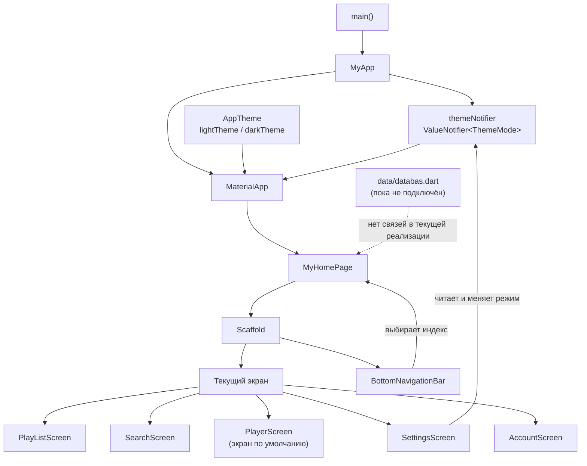

# Wave Player

Flutter-приложение с нижней навигацией между экранами плеера, поиска,
плейлистов, настроек и профиля.

## Архитектура

```mermaid
flowchart TD
    main["main()"] --> app["MyApp"]
    app --> notifier["themeNotifier<br/>ValueNotifier&lt;ThemeMode&gt;"]
    app --> material["MaterialApp"]
    themes["AppTheme<br/>lightTheme / darkTheme"] --> material
    notifier --> material
    material --> home["MyHomePage"]

    home --> scaffold["Scaffold"]
    scaffold --> body["Текущий экран"]
    scaffold --> nav["BottomNavigationBar"]
    nav -->|"выбирает индекс"| home

    body --> playlists["PlayListScreen"]
    body --> search["SearchScreen"]
    body --> player["PlayerScreen<br/>(экран по умолчанию)"]
    body --> settings["SettingsScreen"]
    body --> account["AccountScreen"]

    settings -->|"читает и меняет режим"| notifier

    database["data/databas.dart<br/>(пока не подключён)"]
    database -.->|"нет связей в текущей реализации"| home
```

## Getting Started
